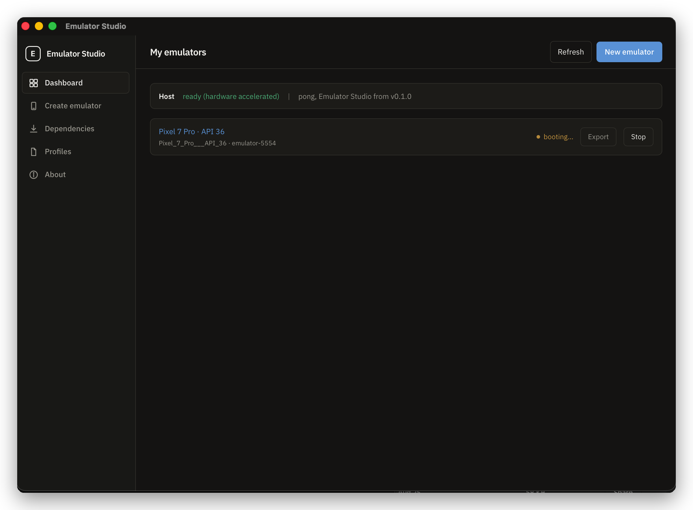
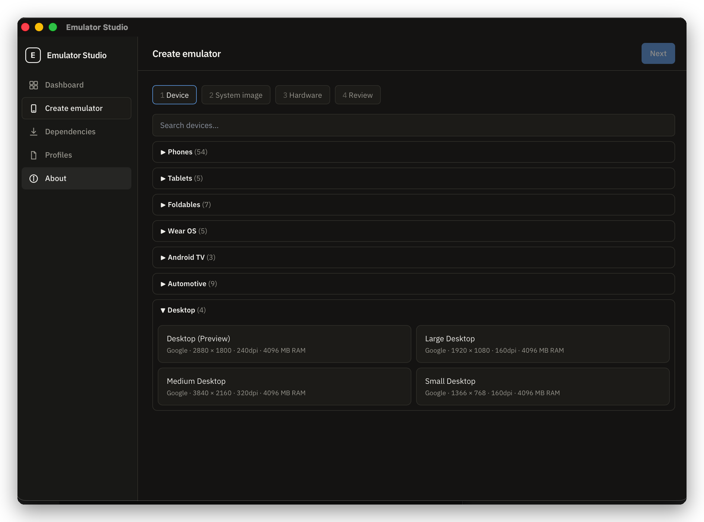
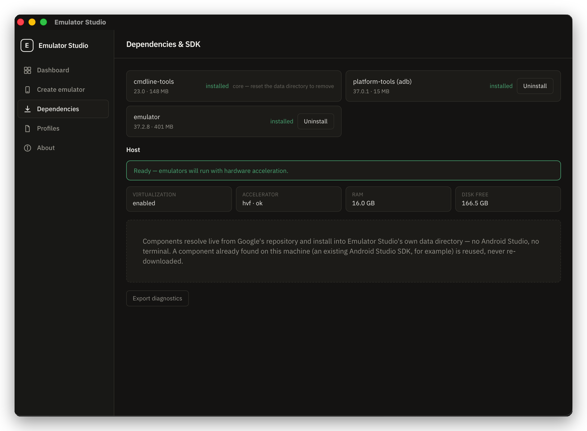

# Emulator Studio

**Create, launch, track, and share Android emulators from one desktop app — no Android Studio.**

Emulator Studio is a small, fast desktop app (Windows, Linux, macOS) for working with Android
Virtual Devices without the IDE. It downloads the exact Android SDK pieces it needs into its own
folder, lets you spin up an emulator from a device + API level in a few clicks, keeps a list of
every emulator you've made with its live running state, and streams its logs while one runs. You
can export any emulator as a portable `.emuprofile` recipe and hand it to a teammate; importing
it re-downloads what's missing and rebuilds the same instance locally.

## What it does

- **SDK from zero** — bootstraps command-line tools, platform-tools, the emulator, and system
  images into its own data directory. Nothing installed system-wide, no IDE, no `sdkmanager`
  incantations. Reuses a real Android SDK if it finds one.
- **Create & launch** — browse device models and API levels, name the emulator, pick RAM /
  storage, launch it (with a real device frame). Your desktop keyboard works inside it.
- **Track** — every emulator you've created, with its live state (stopped / booting / running);
  relaunch, stop, wipe, rename, delete.
- **Watch it run** — a `logcat` viewer with level / tag / text filters and colour-coded
  priorities, plus a facts strip (model, Android version, battery, `/data` usage).
- **Share** — export an emulator to a `.emuprofile` JSON recipe; import one and it resolves and
  downloads what's missing, then re-creates the instance. **Recipes carry no SDK or image bytes.**

## Screenshots

|  |  |
| --- | --- |
|  |  |
| **Dashboard** — every emulator you've made, live state, quick launch/stop/export. | **Create** — device catalogue grouped by form factor, then image, hardware, review. |
|  |  |
| **Logcat** — live device logs with level / tag / text filters and priority colours. | **Dependencies** — the SDK pieces the app manages, install / uninstall, diagnostics. |

## Install

Grab the installer for your OS from the
[Releases page](https://github.com/sachinshettigar/emumanager/releases). Builds are **unsigned**,
so your OS warns on first launch — get past it once and the app runs normally afterwards (the
auto-updater *is* signature-verified).

- **macOS** (`.dmg`) — open it, drag the app to Applications, then **right-click the app → Open →
  Open**. A plain double-click is blocked by Gatekeeper the first time only.
- **Windows** (`.msi` or setup `.exe`) — run it; on the SmartScreen prompt click **More info →
  Run anyway**.
- **Linux** (`.AppImage`) — `chmod +x` it and run. A `.deb` is also provided.

Emulator acceleration needs KVM (Linux), the Windows Hypervisor Platform (Windows), or
Hypervisor.framework (macOS). The app detects what's available and guides you; a one-time
elevated helper handles the parts that need admin rights.

## Build an installer yourself

Prerequisites: **Rust** (stable), **Node 20+**, **pnpm**, and **[`just`](https://github.com/casey/just)**.

```bash
just setup           # install the remaining toolchains + dev deps (idempotent, run once)

just package         # unsigned installer for the current OS      → target/release/bundle/
just package-mac     # macOS .app + .dmg   (append --universal to also build x86_64)
just package-windows # Windows .exe + .msi  — must run ON Windows (PowerShell)
```

Where the artifacts land:

- macOS — `target/release/bundle/macos/Emulator Studio.app` and
  `target/release/bundle/dmg/Emulator Studio_<version>_<arch>.dmg`
- Windows — `src-tauri/target/release/bundle/nsis/…-setup.exe` and `…/msi/…_en-US.msi`
- Linux — `src-tauri/target/release/bundle/appimage/…AppImage` and `…/deb/…deb`

**Each OS's installers can only be built on that OS** — Tauri's bundlers don't cross-compile. From
a Mac you get the macOS installers; Windows and Linux need their own machine, a VM, or CI. Full
matrix, commands, and known local hiccups: [`docs/playbooks/packaging.md`](docs/playbooks/packaging.md).

The `.app` / `.dmg` / `.exe` build fine without any signing key; only the auto-updater feed
artifacts need one, and the build prints a harmless warning when it's absent.

## Run from source

```bash
just dev             # launch the app in dev mode (hot-reload frontend)
```

## Contributing

Development setup, the task workflow, coding standards, and the architecture tour are in
**[`CONTRIBUTING.md`](CONTRIBUTING.md)** and **[`AGENTS.md`](AGENTS.md)**.

## License

TBD before the first public release.
