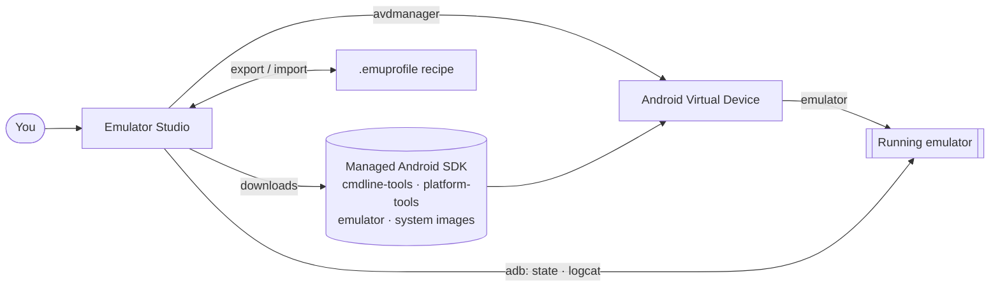

<div align="center">


<h1>Emulator Studio</h1>

**Create, launch, track, and share Android emulators from one desktop app — no Android Studio.**

[](LICENSE)
&nbsp;
&nbsp;
&nbsp;
&nbsp;

[Install](#install) · [Build an installer](#build-an-installer-yourself) · [How it works](#how-it-works) · [Contributing](CONTRIBUTING.md)

</div>

---

Emulator Studio is a small, fast desktop app for working with Android Virtual Devices without the
IDE. It downloads the exact Android SDK pieces it needs into its own folder, lets you spin up an
emulator from a device + API level in a few clicks, keeps a list of every emulator you've made
with its live running state, and streams its logs while one runs. Export any emulator as a
portable `.emuprofile` recipe and hand it to a teammate — importing it re-downloads what's missing
and rebuilds the same instance locally.

## Features

| | |
| --- | --- |
| 📦 **SDK from zero** | Bootstraps command-line tools, platform-tools, the emulator, and system images into its own data directory. No system-wide install, no IDE, no `sdkmanager` incantations — and it reuses a real Android SDK if it finds one. |
| ✨ **Guided create & launch** | Browse devices by form factor and API level, name it, pick RAM / storage, launch with a real device frame. Your desktop keyboard works inside the emulator. |
| 📇 **Live tracking** | Every emulator you've made, with its state (stopped / booting / running). Relaunch, stop, wipe, rename, delete. |
| 🪵 **Watch it run** | A `logcat` viewer with level / tag / text filters and colour-coded priorities, plus a facts strip — model, Android version, battery, `/data` usage. |
| 🔁 **Share a setup** | Export to a `.emuprofile` JSON recipe; import one and it resolves and downloads what's missing, then re-creates the instance. Recipes carry no SDK or image bytes. |
| 🖥️ **Reads your host** | Detects KVM / WHPX / Hypervisor.framework and tells you whether emulators will be hardware-accelerated, degraded, or blocked — with a one-time elevated helper for the fixes that need admin rights. |

## How it works



Everything lives under one data directory; nothing touches a system Android install.

## Emulator Studio vs. the alternatives

| | Emulator Studio | Android Studio's AVD Manager | Raw `sdkmanager` / `avdmanager` |
| --- | :---: | :---: | :---: |
| Footprint | a small app + its own SDK dir | the full IDE (gigabytes) | CLI only, but all manual |
| Create an AVD | guided wizard | dialog inside the IDE | hand-built command line |
| Live running-state list | ✅ | partial | ❌ |
| Logcat + device facts | ✅ built in | ✅ in the IDE | separate `adb` commands |
| Share a configured emulator | ✅ `.emuprofile` recipe | ❌ | ❌ |
| Host-readiness check | ✅ | ❌ | ❌ |

## Install

Grab the installer for your OS from the
[Releases page](https://github.com/sachinshettigar/emumanager/releases).

> [!WARNING]
> Builds are **unsigned**, so your OS warns on first launch. Get past it once and the app runs
> normally afterwards — the auto-updater itself *is* signature-verified.

- **macOS** (`.dmg`) — open it, drag the app to Applications, then **right-click the app → Open →
  Open**. A plain double-click is blocked by Gatekeeper the first time only.
- **Windows** (`.msi` or setup `.exe`) — run it; on the SmartScreen prompt click **More info →
  Run anyway**.
- **Linux** (`.AppImage`) — `chmod +x` it and run. A `.deb` is also provided.

Emulator acceleration needs KVM (Linux), the Windows Hypervisor Platform (Windows), or
Hypervisor.framework (macOS). The app detects what's available and guides you.

## Build an installer yourself

Prerequisites: **Rust** (stable), **Node 20+**, **pnpm**, and
**[`just`](https://github.com/casey/just)**.

```bash
just setup           # install the remaining toolchains + dev deps (idempotent, run once)

just package         # unsigned installer for the current OS
just package-mac     # macOS .app + .dmg   (append --universal to also build x86_64)
just package-windows # Windows .exe + .msi  — must run ON Windows (PowerShell)
```

> [!NOTE]
> **Each OS's installers can only be built on that OS** — Tauri's bundlers don't cross-compile.
> From a Mac you get the macOS installers; Windows and Linux need their own machine, a VM, or CI.

<details>
<summary>Where the artifacts land &nbsp;·&nbsp; signing</summary>

- macOS — `target/release/bundle/macos/Emulator Studio.app` and
  `target/release/bundle/dmg/Emulator Studio_<version>_<arch>.dmg`
- Windows — `src-tauri/target/release/bundle/nsis/…-setup.exe` and `…/msi/…_en-US.msi`
- Linux — `src-tauri/target/release/bundle/appimage/…AppImage` and `…/deb/…deb`

The `.app` / `.dmg` / `.exe` build fine without any signing key; only the auto-updater feed
artifacts need one, and the build prints a harmless warning when it's absent. Full matrix,
commands, and known local hiccups: [`docs/playbooks/packaging.md`](docs/playbooks/packaging.md).

</details>

## Run from source

```bash
just dev             # launch the app in dev mode (hot-reload frontend)
```

## Contributing

Development setup, the task workflow, coding standards, and the architecture tour are in
**[`CONTRIBUTING.md`](CONTRIBUTING.md)** and **[`AGENTS.md`](AGENTS.md)**.

## License

[MIT](LICENSE) © Sachin Shettigar
